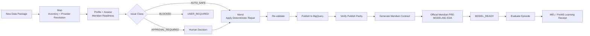
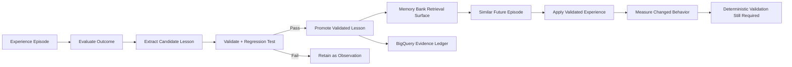

# PreM3

**A self-learning, autonomous pre-modeling agent for Google Meridian.**

*Map. Mend. Model.*

PreM3 turns fragmented marketing measurement data into a verified model-consumption endpoint for Google Meridian. It maps and repairs source data, independently verifies the BigQuery model input, runs official Meridian pre-modeling EDA, interprets the findings, and produces an actionable modeler handoff.

Evaluated episodes feed MEL, the PreM3 Experience Loop, so validated experience can improve future execution. A PreM3 Learning Receipt is generated only when a scoped lesson is actually promoted.

Give PreM3 the data. It completes the pre-modeling assignment.

## What PreM3 is

PreM3 is one coherent autonomous Taskmaster. It is the product and the agent. Users do not need a separate worker name.

**M3** is the operating method inside PreM3: **Map. Mend. Model.** It also naturally references Media Mix Modeling.

In **Map. Mend. Model.**, **Model** means constructing and proving the model-consumption package—not fitting the Meridian MMM.

`MODEL_READY` is the verified pre-modeling terminal state. It is not the product name.

PreM3 was originally developed under the working name ModelReady. Some internal cloud identifiers retain that namespace for compatibility.

## Implementation status

### Proven

- autonomous Dataset A preparation
- BigQuery model-consumption verification
- official Meridian EDA in an isolated Cloud Run Job
- modeler handoff
- user resolution path (`USER_REQUIRED` when PreM3 cannot safely continue)

### Next / active milestone

- MMM intelligence/context system
- MEL Episode Core
- validated experience retrieval/application
- Ambient Taskmaster trigger

Do not treat MEL as proven. A PreM3 Learning Receipt is generated only when a scoped lesson is actually promoted.

## Product flow

```text
Fragmented marketing data
        ↓
       MAP
        ↓
       MEND
        ↓
     VALIDATE
        ↓
     PUBLISH
        ↓
      VERIFY
        ↓
      EXPLORE
        ↓
    INTERPRET
        ↓
     HANDOFF
        ↓
   MODEL_READY
        ↓
        MEL
```

Model fitting is not part of this default path.

## Hackathon target

Google All Things Agentic Hackathon — **Taskmaster** track.

The required terminal state for the golden path is:

```text
PRE_MODELING_COMPLETE
MODEL_READY
✓ deterministic readiness passed
✓ BigQuery model artifact published
✓ publish parity passed
✓ Meridian input contract generated
✓ official Meridian pre-modeling EDA (zero ERROR)
✓ provenance complete
```

PreM3 does not optimize conversation quality. It completes a verifiable operational task: action, artifact, proof, failure boundary, and recovery path.

A chatbot can explain Meridian documentation. PreM3 examines real data, makes bounded decisions, executes deterministic tools, repairs authorized defects, creates the model endpoint, reads it back, runs official Meridian EDA, interprets real findings, fails closed, explains resolution, and creates durable evidence.

Autonomous official pre-modeling EDA is required. It runs in isolated Cloud Run Job `meridian-eda-worker` (Python 3.12, `google-meridian==1.8.0`). The PreM3 ADK runtime does not install `google-meridian`. After BigQuery publish the run enters `EXPLORING`; `MODEL_READY` requires the official EDA gate (zero ERROR). ATTENTION is review-recommended. Official input rejection or ERROR produces a `USER_REQUIRED` resolution pack (`agent_can_fix=false`). Posterior sampling / Meridian fitting remains outside autonomous authority.

`MODEL_READY` means the pre-modeling contract and official EDA gate pass. It does not guarantee posterior convergence, identifiability, stable ROI, business usefulness, or a particular modeler's final specification.

## System architecture

```mermaid
flowchart TD
    U[Web UI / Upload] --> GCS[Google Cloud Storage\nraw/{workspace_id}/{run_id}]
    GCS --> RUN[Cloud Run\nPreM3 / Google ADK]

    RUN --> GEM[Gemini\nreasoning + routing]
    RUN --> TOOLS[Deterministic Tools\nprofile • map • repair • validate]
    RUN --> STATE[Run State / Approvals]

    TOOLS --> OUT[Versioned Artifacts + Provenance\nCloud Storage]
    TOOLS --> BQMODEL[BigQuery\nmodel-consumption table / view]
    TOOLS --> CONTRACT[Meridian Input Contract]

    RUN --> BQOPS[BigQuery\nRuns • Issues • Actions • Evals]
    RUN --> JOB[Isolated Meridian EDA\nCloud Run Job]
    JOB --> EDA[Official EDA evidence]
    EDA --> INTERP[PreM3 interpretation / handoff]
    INTERP --> GATE[MODEL_READY Gate]
    BQMODEL --> PARITY[Independent BigQuery verification]
    PARITY --> GATE
    CONTRACT --> GATE
    GATE --> READY[MODEL_READY]
    READY --> MEL[MEL\nPreM3 Experience Loop]
    READY --> APPROVAL{Approve Meridian fit?}
    APPROVAL -->|Optional / approved| MERIDIAN[Google Meridian posterior]
```

### Architectural boundaries

- **PreM3 / ADK** owns state transitions, routing, retry behavior, approval pauses, and completion flow.
- **Gemini** handles reasoning where semantic interpretation is required.
- **Deterministic tools** own calculations, transformations, readiness validation, BigQuery publishing, and parity verification.
- **Official Meridian** calculates EDA findings.
- **Cloud Storage** preserves immutable raw inputs and versioned output artifacts.
- **BigQuery** serves two roles: operational/experience telemetry and the final model-consumption publishing contract.
- **Vertex AI Memory Bank** is a future retrieval surface for validated generalized experience, not the authoritative ledger.
- **User-resolution pack** is first-class output when Meridian rejects input or returns ERROR.
- **Meridian posterior / fitting** is deliberately separated from `MODEL_READY` and remains modeler-governed.

> **Gemini decides. Deterministic code proves. Meridian calculates. Gemini interprets.**

Agent prose, confidence, or memory can never independently mark a run `MODEL_READY`.

## PreM3 operating flow



## PreM3 Experience Loop (MEL)

PreM3 is designed to demonstrate **experiential learning**, not merely conversational memory.

**PreM3 has learned only when evaluated experience changes future behavior, and the changed behavior can be shown to remain correct.**



MEL follows a strict safety model:

1. Every completed run can become an `ExperienceEpisode` containing context, trajectory, issues, actions, feedback, validator results, cost/latency, and final outcome.
2. Deterministic outcome evaluation has the highest authority. ADK trajectory evaluation, human feedback, and LLM rubric evaluation provide additional evidence.
3. Candidate lessons are explicitly scoped and carry provenance, evidence, confidence, and risk.
4. Lessons are promoted only when evidence supports them and regression tests do not weaken established behavior.
5. Retrieved experience may influence reasoning, routing, mapping, or an already-safe transformation policy, but it **never bypasses final deterministic validators**.
6. BigQuery is the auditable experience ledger; Vertex AI Memory Bank stores concise validated knowledge for retrieval.
7. Policy/prompt optimization, if used, occurs offline and under regression testing rather than through uncontrolled runtime self-modification.

### PreM3 Learning Receipts

Learning must be visible and auditable. PreM3 therefore treats **PreM3 Learning Receipts** as first-class product and demo artifacts.

There are two receipt types:

**`EXPERIENCE_LEARNED`** — generated when evaluated evidence supports promotion of a reusable lesson.

**`EXPERIENCE_APPLIED`** — generated when a validated lesson materially changes a later run.

Completed episodes are evaluated by MEL. A PreM3 Learning Receipt is generated only when a scoped lesson is actually promoted.

**Learning metrics must come from actual runs. They must never be hard-coded for the demo.**

## Roadmap

1. Pre-modeling golden proof — **COMPLETE**
2. PreM3 rebrand — **CURRENT**
3. MMM intelligence/context system
4. MEL Episode Core
5. Ambient Taskmaster
6. Experience Applied / Dataset B
7. Dataset C holdout
8. Competition packaging

## Engineering principles

- Raw inputs are immutable.
- Every transformation has provenance.
- Deterministic calculations stay deterministic.
- Prompts, rules, registry entries, and learned policies are versioned.
- Ambiguous semantic transformations fail closed or require approval.
- Validated artifacts are published into run-scoped/versioned BigQuery contracts.
- `MODEL_READY` requires readiness validation, verified publish parity, and official Meridian EDA with zero ERROR.
- Meridian model execution remains outside autonomous authority.
- Learning is evidence-driven and cannot disable validation guardrails.
- Demo reliability is more important than feature breadth.

## Repository layout

```text
app/
├── agent.py            # ADK root agent / PreM3 orchestration entrypoint
├── config.py           # environment-driven runtime config
├── core/               # typed contracts, run state, domain errors
├── agents/             # focused reasoning boundaries
├── tools/              # deterministic profiling/remediation/validation/publish
├── integrations/       # GCS, BigQuery, Vertex adapters
├── registry/           # provider-registry schema and sourced provider entries
└── rules/              # versioned Meridian-oriented rule catalog

tests/
├── unit/
├── integration/
├── regression/
└── fixtures/music_center/

evals/                  # ADK evaluation configuration and future datasets
docs/context/           # canonical War Room source of truth
scripts/                # safe bootstrap/demo utilities
deployment/             # Cloud Run/GCP deployment guidance
```

## Local setup

Python 3.13 is the current repo target.

```bash
python -m venv .venv
source .venv/bin/activate        # Windows PowerShell: .venv\Scripts\Activate.ps1
python -m pip install -e ".[dev]"
cp .env.example .env
```

For local Google Cloud development, authenticate with Application Default Credentials and select the hackathon project:

```bash
gcloud auth application-default login
gcloud config set project modelready-m3
```

Then run the unit checks:

```bash
ruff check app tests
pytest tests/unit
```

## Google Cloud project

Hackathon/development project: `modelready-m3`.

All project IDs, bucket names, datasets, regions, and model names are configuration-driven. Do not hard-code cloud resource identifiers.

Some infrastructure and internal machine identifiers retain the earlier `modelready-m3` / `m3` namespace for compatibility with proven cloud deployments. They are implementation identifiers, not a separate product.

The safe bootstrap script only enables core APIs:

```bash
bash scripts/bootstrap_gcp.sh
```

It intentionally does not create IAM bindings, buckets, datasets, triggers, or deploy services without an explicit implementation step.

## Shared context for coding agents

Before changing architecture or implementation, read:

1. `AGENTS.md`
2. `docs/PREM3_BRAND_AND_NAMING.md`
3. `docs/context/00_HACKATHON_MASTER_CONTEXT.md`
4. `docs/context/02_SYSTEM_ARCHITECTURE.md`
5. `docs/context/03_EXPERIENTIAL_LEARNING_FRAMEWORK.md`
6. the relevant workstream specification

Do not add agents, infrastructure, or SaaS features merely because they may be useful later. The Aug 31 hackathon demo is the current product constraint.

## Current status

Present now:
- ADK root-agent entrypoint identifying as PreM3;
- canonical state model through `PUBLISHING` → `EXPLORING` → `MODEL_READY`;
- typed issue/transformation/publish/learning contracts;
- deterministic inventory, profiling, mapping, remediation, validation, artifact, and BigQuery publish primitives;
- independent BigQuery model-consumption verification;
- isolated official Meridian pre-modeling EDA worker;
- user-resolution pack and modeler handoff;
- GCS/BigQuery/Vertex integration boundaries;
- versioned readiness-rule catalog seed;
- provider-registry schema and evidence guardrail;
- unit/integration/regression test structure;
- Music Center golden-fixture manifest;
- Cloud Run deployment notes.

Still to be implemented:
- MEL Episode Core and validated experience application;
- Eventarc / Ambient Taskmaster;
- MMM intelligence/context system;
- polished judge-facing run/learning UI.

## First proven milestone

A Music Center Dataset A package runs end-to-end through PreM3 and reaches `MODEL_READY` with a verified BigQuery artifact and official Meridian EDA (zero ERROR).
