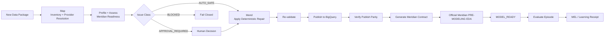
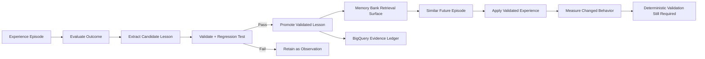

# ModelReady

**Autonomous Data Preparation for Marketing Measurement**

ModelReady is a Taskmaster agent that autonomously transforms fragmented marketing and advertising datasets into validated, model-ready inputs for Google Meridian. Using Gemini, Google ADK, Cloud Run, BigQuery, and Google Cloud storage/event infrastructure, its M3 Agent profiles, maps, safely remediates, validates, publishes, and learns from completed data-preparation workflows.

## M3 Agent

**M3 = Map. Mend. Model-Ready.**

ModelReady is the product. M3 is the autonomous worker. Google Meridian is the first modeling target.

The design goal is not a decorative swarm of agents. M3 is one coherent Taskmaster worker implemented with an ADK orchestrator, focused reasoning boundaries, deterministic tools, durable state, explicit approval gates, and an evidence-driven experience loop.

## Hackathon target

Google All Things Agentic Hackathon — **Taskmaster** track.

The required terminal state for the golden path is:

```text
PRE_MODELING_COMPLETE
MODEL_READY
✓ deterministic readiness passed
✓ BigQuery model artifact published
✓ publish parity passed
✓ Meridian input contract generated
✓ official Meridian pre-modeling EDA (zero ERROR)
✓ provenance complete
```

Autonomous official pre-modeling EDA is required. It runs in isolated Cloud Run Job `meridian-eda-worker` (Python 3.12, `google-meridian==1.8.0`). The M3 ADK runtime does not install `google-meridian`. After BigQuery publish the run enters `EXPLORING`; `MODEL_READY` requires the official EDA gate (zero ERROR). ATTENTION is review-recommended. Official input rejection or ERROR produces a `USER_REQUIRED` resolution pack (`agent_can_fix=false`). Posterior sampling / Meridian fitting remains approval-gated.

## System architecture

```mermaid
flowchart TD
    U[Web UI / Upload] --> GCS[Google Cloud Storage\nraw/{workspace_id}/{run_id}]
    GCS --> EVT[Eventarc / Pub/Sub]
    EVT --> RUN[Cloud Run\nM3 Agent / Google ADK]

    RUN --> GEM[Gemini\nreasoning + routing]
    RUN --> TOOLS[Deterministic Tools\nprofile • map • repair • validate]
    RUN --> STATE[Run State / Approvals]

    TOOLS --> OUT[Versioned Artifacts + Provenance\nCloud Storage]
    TOOLS --> BQMODEL[BigQuery\nModel-Ready Table / View]
    TOOLS --> CONTRACT[Meridian Input Contract]

    RUN --> BQOPS[BigQuery\nRuns • Issues • Actions • Evals]
    RUN --> MEL[MEL\nModelReady Experience Loop]
    MEL --> MEMORY[Vertex AI Memory Bank\nvalidated reusable experience]
    MEL --> BQEXP[BigQuery\nExperience Ledger]

    BQMODEL --> PARITY[Deterministic Publish-Parity Check]
    OUT --> PARITY
    CONTRACT --> GATE[MODEL_READY Gate]
    PARITY --> GATE

    GATE --> READY[MODEL_READY]
    READY --> APPROVAL{Approve Meridian run?}
    APPROVAL -->|Optional / approved| MERIDIAN[Google Meridian]
```

### Architectural boundaries

- **M3 Orchestrator / ADK** owns state transitions, routing, retry behavior, approval pauses, and completion flow.
- **Gemini** handles reasoning where semantic interpretation is required.
- **Deterministic tools** own calculations, transformations, readiness validation, BigQuery publishing, and parity verification.
- **Cloud Storage** preserves immutable raw inputs and versioned output artifacts.
- **BigQuery** serves two roles: operational/experience telemetry and the final model-ready publishing contract.
- **Vertex AI Memory Bank** is a retrieval surface for validated generalized experience, not the authoritative ledger.
- **Official Meridian EDA** runs in an isolated Cloud Run Job. Gemini interprets structured findings; it does not choose severity or `MODEL_READY`.
- **User-resolution pack** is first-class output when Meridian rejects input or returns ERROR.
- **Meridian posterior / fitting** is deliberately separated from `MODEL_READY` and remains approval-gated.

> **LLM decides; deterministic code proves.**

Agent prose, confidence, or memory can never independently mark a run `MODEL_READY`.

## M3 operating flow



## ModelReady Experience Loop (MEL)

ModelReady is designed to demonstrate **experiential learning**, not merely conversational memory.

**Learning is present only when a prior evaluated episode causes a measurable improvement in a future decision or execution path.**



MEL follows a strict safety model:

1. Every completed run can become an `ExperienceEpisode` containing context, trajectory, issues, actions, feedback, validator results, cost/latency, and final outcome.
2. Deterministic outcome evaluation has the highest authority. ADK trajectory evaluation, human feedback, and LLM rubric evaluation provide additional evidence.
3. Candidate lessons are explicitly scoped and carry provenance, evidence, confidence, and risk.
4. Lessons are promoted only when evidence supports them and regression tests do not weaken established behavior.
5. Retrieved experience may influence reasoning, routing, mapping, or an already-safe transformation policy, but it **never bypasses final deterministic validators**.
6. BigQuery is the auditable experience ledger; Vertex AI Memory Bank stores concise validated knowledge for retrieval.
7. Policy/prompt optimization, if used, occurs offline and under regression testing rather than through uncontrolled runtime self-modification.

### M3 Learning Receipts

Learning must be visible and auditable. ModelReady therefore treats **M3 Learning Receipts** as first-class product and demo artifacts.

There are two receipt types:

**`EXPERIENCE_LEARNED`** — generated when evaluated evidence supports promotion of a reusable lesson.

Minimum proof includes:
- originating run / episode;
- observed condition;
- action or decision learned;
- deterministic evidence;
- confidence and risk;
- scope;
- promotion status;
- regression result;
- expected future behavior.

**`EXPERIENCE_APPLIED`** — generated when a validated lesson materially changes a later run.

Minimum proof includes:
- lesson ID and evidence count;
- previous behavior versus current behavior;
- measurable change such as fewer tool calls, fewer approvals, faster routing, or improved mapping confidence;
- final deterministic validation result;
- BigQuery publication evidence when the lesson affects the model artifact.

The demo target is two related episodes:

```text
Episode A
new schema ambiguity
→ M3 resolves/evaluates it
→ candidate lesson validated
→ EXPERIENCE_LEARNED receipt

Episode B
similar future schema
→ prior lesson retrieved
→ fewer ambiguous steps / approvals
→ deterministic checks still pass
→ EXPERIENCE_APPLIED receipt
```

**Learning metrics must come from actual runs. They must never be hard-coded for the demo.**

## MVP vertical slice

```text
Upload / fixture
  → M3 / ADK orchestration
  → provider resolution
  → deterministic profiling
  → Meridian-oriented readiness rules
  → safe remediation
  → deterministic validation
  → BigQuery model table/view publish
  → publish parity verification
  → Meridian input contract
  → MODEL_READY
```

The architecture above is the hackathon target. Implementation remains deliberately phased: the P0 goal is first to make one end-to-end `MODEL_READY` run reliable; MEL and the two-episode Learning Receipt proof follow immediately after that vertical slice is stable.

## Engineering principles

- Raw inputs are immutable.
- Every transformation has provenance.
- Deterministic calculations stay deterministic.
- Prompts, rules, registry entries, and learned policies are versioned.
- Ambiguous semantic transformations fail closed or require approval.
- Validated artifacts are published into run-scoped/versioned BigQuery contracts.
- `MODEL_READY` requires readiness validation **and** verified publish parity.
- Meridian model execution remains approval-gated.
- Learning is evidence-driven and cannot disable validation guardrails.
- Demo reliability is more important than feature breadth.

## Repository layout

```text
app/
├── agent.py            # ADK root agent / M3 orchestration entrypoint
├── config.py           # environment-driven runtime config
├── core/               # typed contracts, run state, domain errors
├── agents/             # focused reasoning boundaries
├── tools/              # deterministic profiling/remediation/validation/publish
├── integrations/       # GCS, BigQuery, Vertex adapters
├── registry/           # provider-registry schema and sourced provider entries
└── rules/              # versioned Meridian-oriented rule catalog

tests/
├── unit/
├── integration/
├── regression/
└── fixtures/music_center/

evals/                  # ADK evaluation configuration and future datasets
docs/context/           # canonical War Room source of truth
scripts/                # safe bootstrap/demo utilities
deployment/             # Cloud Run/GCP deployment guidance
```

## Local setup

Python 3.13 is the current repo target.

```bash
python -m venv .venv
source .venv/bin/activate        # Windows PowerShell: .venv\Scripts\Activate.ps1
python -m pip install -e ".[dev]"
cp .env.example .env
```

For local Google Cloud development, authenticate with Application Default Credentials and select the hackathon project:

```bash
gcloud auth application-default login
gcloud config set project modelready-m3
```

Then run the unit checks:

```bash
ruff check app tests
pytest tests/unit
```

## Google Cloud project

Hackathon/development project: `modelready-m3`.

All project IDs, bucket names, datasets, regions, and model names are configuration-driven. Do not hard-code cloud resource identifiers.

The safe bootstrap script only enables core APIs:

```bash
bash scripts/bootstrap_gcp.sh
```

It intentionally does not create IAM bindings, buckets, datasets, triggers, or deploy services without an explicit implementation step.

## Shared context for coding agents

Before changing architecture or implementation, read:

1. `AGENTS.md`
2. `docs/context/00_HACKATHON_MASTER_CONTEXT.md`
3. `docs/context/02_SYSTEM_ARCHITECTURE.md`
4. `docs/context/03_EXPERIENTIAL_LEARNING_FRAMEWORK.md`
5. the relevant workstream specification

Do not add agents, infrastructure, or SaaS features merely because they may be useful later. The Aug 31 hackathon demo is the current product constraint.

## Current scaffold status

Present now:
- ADK root-agent entrypoint;
- canonical M3 state model;
- typed issue/transformation/publish/learning contracts;
- deterministic inventory, profiling, mapping, remediation, validation, artifact, and BigQuery publish primitives;
- GCS/BigQuery/Vertex integration boundaries;
- versioned readiness-rule catalog seed;
- provider-registry schema and evidence guardrail;
- unit/integration/regression test structure;
- Music Center golden-fixture manifest;
- evaluation config;
- Cloud Run deployment notes and API bootstrap script;
- synchronized War Room context.

Still to be implemented for the full hackathon architecture:
- executable end-to-end run coordination;
- real BigQuery publish + parity proof;
- event-driven GCS ingestion;
- episode/evaluation persistence;
- lesson promotion/regression pipeline;
- Vertex AI Memory Bank retrieval;
- generated `EXPERIENCE_LEARNED` and `EXPERIENCE_APPLIED` receipts from actual run evidence;
- polished judge-facing run/learning UI.

## First milestone — do not broaden before this works

A single Music Center dataset must run end-to-end through M3 and reach `MODEL_READY` with a verified BigQuery artifact:

```text
fixture
→ profile
→ detect 3–5 seeded issues
→ make 1–2 AUTO_SAFE repairs
→ deterministic readiness PASS
→ publish BigQuery model table/view
→ publish parity PASS
→ generate Meridian input contract
→ MODEL_READY
```

Only after this vertical slice is reliable should implementation expand into the full two-episode MEL proof, event-driven ingestion, and judge-facing UI polish.
