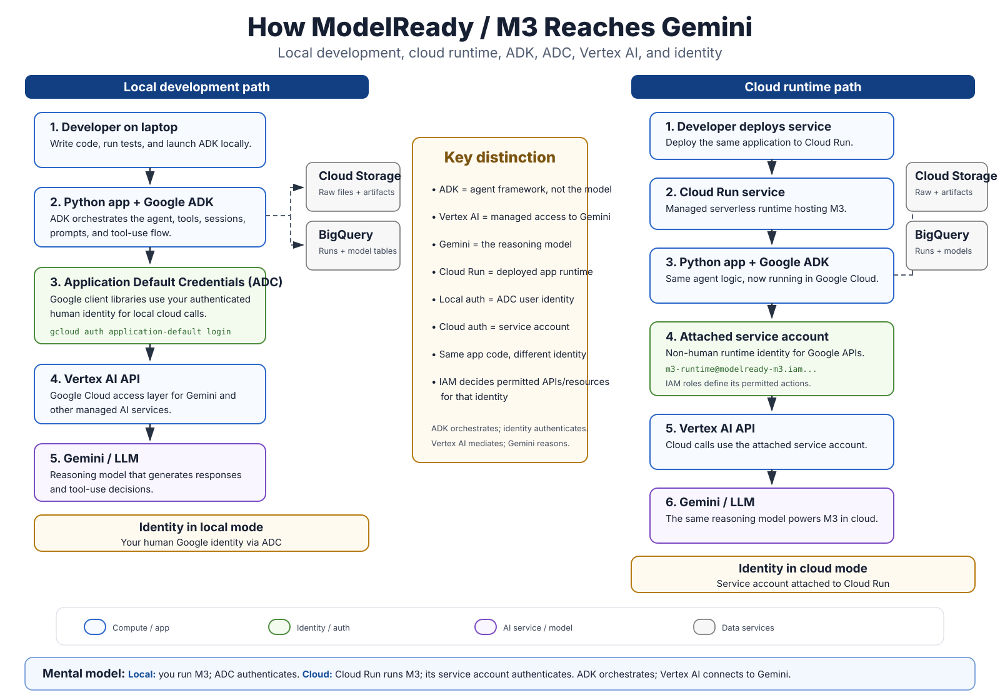

# ADK Runtime and Identity Model

This context note explains how the same ModelReady/M3 agent code reaches Gemini during local development and when deployed to Google Cloud.



## Core mental model

**ADK orchestrates. Identity authenticates. Vertex AI mediates access. Gemini reasons.**

The application logic can remain substantially the same between local and cloud execution. What changes is the runtime and the identity used to authenticate calls to Google Cloud services.

## Local development path

```text
Developer laptop
    ↓
Python application + Google ADK
    ↓
Application Default Credentials (ADC)
    ↓
Vertex AI API
    ↓
Gemini

ADK tools may also call:
    ├── Cloud Storage
    └── BigQuery
```

During local development, the developer runs the Python/ADK application. Google client libraries discover **Application Default Credentials**. In our development workflow these credentials represent the authenticated human Google identity created through `gcloud auth application-default login`.

ADC is not a Google Cloud service and it is not an authorization role. It is the standard credential-discovery mechanism used by Google client libraries. IAM permissions attached to the discovered identity determine what that identity is actually allowed to do.

## Cloud runtime path

```text
Developer deploys
    ↓
Cloud Run
    ↓
Python application + Google ADK
    ↓
Attached service account
    ↓
Vertex AI API
    ↓
Gemini

ADK tools may also call:
    ├── Cloud Storage
    └── BigQuery
```

In Cloud Run, the application no longer uses the developer's human identity. The Cloud Run service runs as its attached service account. For the hackathon environment, the intended M3 runtime identity is:

```text
m3-runtime@modelready-m3.iam.gserviceaccount.com
```

The service account is a **non-human workload identity**. IAM roles assigned to that service account determine whether M3 may invoke Vertex AI, run BigQuery jobs, access specific Cloud Storage buckets, and perform other Google Cloud operations.

No service-account key file should be committed or required. Cloud Run supplies credentials to the workload through the Google Cloud runtime environment.

## Layer responsibilities

| Layer | Purpose | What it is not |
|---|---|---|
| Google ADK | Agent framework: orchestration, agents, tools, sessions, state/flow | The LLM itself |
| ADC | Standard mechanism for discovering credentials in local/client-library execution | An IAM role or AI service |
| Cloud Run | Managed serverless compute that hosts the deployed M3 application | The agent framework or model |
| Service account | Non-human workload identity used by M3 in Google Cloud | A password or application secret |
| IAM | Authorization policy defining what an identity may do | The identity itself |
| Vertex AI | Google Cloud managed API/access layer through which M3 uses Gemini | M3's orchestration framework |
| Gemini | Reasoning model used by M3 for semantic decisions and tool-use reasoning | Deterministic validation logic |
| Cloud Storage | Raw and versioned artifact storage | Run database / model reasoning layer |
| BigQuery | Run/evidence ledger and model-ready publication contract | Agent memory alone |

## Why identity separation matters

Local development and deployed execution should not depend on the same human credentials. The separation gives ModelReady a production-minded trust boundary:

```text
LOCAL
human developer identity
    ↓
ADC
    ↓
Google Cloud APIs

CLOUD
M3 workload identity
    ↓
Cloud Run service account
    ↓
Google Cloud APIs
```

This makes permissions auditable and lets us apply least privilege to the deployed worker independently of the developer's account.

## ModelReady-specific authority

The runtime identity may be granted only the capabilities needed by M3, such as:

- invoke Gemini through Vertex AI;
- execute BigQuery jobs and write ModelReady-owned datasets;
- read raw input objects from the designated Cloud Storage bucket;
- write versioned output/provenance artifacts to the designated artifact bucket.

This identity boundary does **not** change ModelReady's higher-level guardrails. IAM permission to perform an action does not automatically mean the agent is product-authorized to perform it. For example, M3 may publish a validated run-scoped model artifact autonomously, while launching a Meridian model remains an explicit approval-gated product action.

## Relationship to the engineering principle

> **LLM decides; deterministic code proves.**

Gemini may reason about provider identity, semantic mapping, routing, and remediation planning. ADK coordinates that reasoning and tool execution. Deterministic tools still own calculations, readiness checks, publish-parity verification, and the `MODEL_READY` completion gate.

## Practical debugging question

When a Google Cloud call fails, identify the layer before changing code:

```text
Did ADK choose/call the expected tool?
        ↓
Did the application discover an identity?
        ↓
Is that the identity we expected (ADC user vs service account)?
        ↓
Does IAM authorize that identity for the resource/action?
        ↓
Is the target API enabled and resource correctly configured?
        ↓
Did Vertex AI / BigQuery / Storage accept the request?
```

This separation is useful for both debugging and judge-facing architecture proof because it makes orchestration, runtime, authentication, authorization, data services, and model reasoning distinct and observable.
