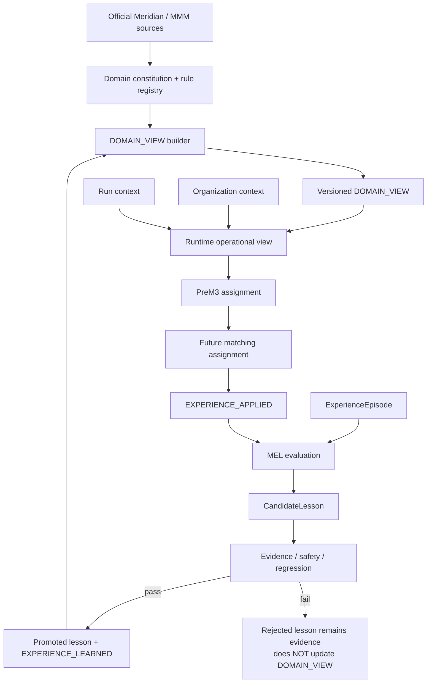

# PreM3 DOMAIN_VIEW

**DOMAIN_VIEW** is PreM3's versioned operational understanding of its domain: authoritative source knowledge, current policies, validated heuristics, and promoted experiential lessons that are permitted to influence future behavior.

It is **versioned**, **operational**, **justified**, **authorized**, **scoped**, and **provenanced**.

It is not everything PreM3 has seen.

---

## What DOMAIN_VIEW is

The constitution tells PreM3 what must remain true.

DOMAIN_VIEW tells PreM3 what evaluated evidence currently justifies it believing and using.

MEL determines whether experience is allowed to change DOMAIN_VIEW.

`EXPERIENCE_APPLIED` proves that a learned change later affected behavior while remaining correct.

## Why it exists

Most agent systems can retrieve memory. PreM3 distinguishes memory from learning.

A run becomes evidence. Evidence may create a candidate lesson. A candidate lesson must survive evaluation. Only promoted lessons may change DOMAIN_VIEW. DOMAIN_VIEW is versioned and inspectable. A later `EXPERIENCE_APPLIED` event proves the lesson changed future behavior without breaking correctness.

## What it is not

DOMAIN_VIEW is not:

- chat history;
- arbitrary memory;
- a vector-database dump;
- unfiltered observations;
- uncontrolled self-modification;
- a replacement for official Meridian documentation;
- a place for customer-specific facts to leak into global knowledge;
- a hand-maintained second handbook.

`docs/context/domain-view/DOMAIN_VIEW.md` is a **generated projection**. The machine-readable state is `app/domain/intelligence/data/current/domain_view.json`.

## Constitution vs DOMAIN_VIEW

| Artifact | Role |
|---|---|
| `PREM3_MMM_BOOT_CONTEXT.md` | Constitution — durable principles and boundaries |
| Rule registries | Machine-readable current rules and specified diagnostics |
| DOMAIN_VIEW | Current justified operational worldview compiled from those sources plus promoted lessons |
| Organization context | Durable situational knowledge for one organization |
| Run context | Working evidence for this assignment |

Rebuilding the same sources tomorrow must not invent a fake knowledge change.

## Human-mind analogy

This is an **architectural analogy**, not a claim that PreM3 has a mind or consciousness.

| Concept | Analogy |
|---|---|
| Domain constitution | Durable principles / boundaries |
| DOMAIN_VIEW | Current justified operational worldview |
| Organization context | Durable situational knowledge |
| Run context | Working context |
| MEL | Evaluated learning process |
| EXPERIENCE_APPLIED | Evidence that learning later changed behavior |

## Knowledge authority

Precedence, highest first:

1. `MERIDIAN_NORMATIVE`
2. `PREM3_POLICY`
3. `VERIFIED_DOMAIN_GUIDANCE`
4. `VALIDATED_EXPERIENCE_PATTERN`
5. `ADVISORY_LEARNED_PATTERN` / `ROUTING_HINT`
6. `OBSERVATION` / hypothesis

Lower layers cannot silently override higher layers.

Learned authority, when a claim is experiential:

`OBSERVATION_ONLY` · `ADVISORY` · `ROUTING_HINT` · `AUTO_SAFE_POLICY`

`AUTO_SAFE_POLICY` requires the strongest promotion standard. No learned item may autonomously grant authority over final priors, final ModelSpec, posterior sampling, model fitting, or causal-business decisions.

## How DOMAIN_VIEW is built

```text
meridian.yaml + intelligence_registry.yaml + base_claims.yaml
        + promoted_lessons.yaml (empty until MEL exists)
        ↓
deterministic builder
        ↓
validate → fingerprint → version → serialize → Markdown projection
```

Command:

```text
.venv\Scripts\python.exe -m app.domain.intelligence
```

## How DOMAIN_VIEW changes

A version increments only when operational content changes.

Change types:

`OFFICIAL_SOURCE_UPDATE` · `POLICY_UPDATE` · `HEURISTIC_UPDATE` · `EXPERIENCE_LEARNED` · `LESSON_AUTHORITY_CHANGE` · `LESSON_SCOPE_CHANGE` · `LESSON_REVOKED` · `LESSON_SUPERSEDED`

If documentation or a developer edited a rule, report **domain knowledge was updated**. Reserve **I learned** for `PROMOTED_EXPERIENCE`.

## How MEL will update it

```text
ExperienceEpisode
  → CandidateLesson
  → evidence / safety / regression
  → EXPERIENCE_LEARNED
  → DOMAIN_VIEW version change
  → future retrieval
  → changed behavior
  → EXPERIENCE_APPLIED
```

Rejected candidates remain evidence. They do **not** update DOMAIN_VIEW.

MEL Episode Core is **not implemented** in this mission. Promoted lessons are an input contract.

## How learning is promoted

A candidate may enter DOMAIN_VIEW only if it is `PROMOTED`, scoped, non-identifying, regression-passing, and does not override Meridian normative rules or PreM3 safety policy.

## Global vs organization vs run context

```text
GLOBAL DOMAIN_VIEW
        +
ORGANIZATION CONTEXT
        +
CURRENT RUN CONTEXT
        =
PREM3 OPERATIONAL CONTEXT FOR THIS ASSIGNMENT
```

Run data cannot overwrite DOMAIN_VIEW. Organization context cannot overwrite Meridian normative truth. Organization-specific facts (fiscal week start, promotion process) stay organization-scoped.

## How PreM3 uses DOMAIN_VIEW

Reasoning agents may consult the current view for authorized operational claims. Execution still uses deterministic tools and official Meridian for official findings. The isolated Meridian EDA worker does not load product prose.

## How to inspect the current view

Summarize version, fingerprint, source versions, promoted-lesson count, and authority distribution. Do not dump every claim into chat.

- Markdown: [`DOMAIN_VIEW.md`](DOMAIN_VIEW.md)
- JSON: `app/domain/intelligence/data/current/domain_view.json`
- History: `app/domain/intelligence/data/history/`

## How to diff versions

`diff_domain_views(previous, current)` reports added, removed, modified, authority, scope, source-update, and experiential-learning changes. Timestamps are ignored.

## Security and privacy

Global DOMAIN_VIEW must not contain customer names, organization IDs, private schemas, raw KPI values, provider account IDs, or run-specific facts. A global lesson must be generalized, scoped, and non-identifying.

## What learning may never change

- official Meridian requirements
- missing-media safety (unknown absence is not automatically zero)
- final priors / final ModelSpec / knots as final policy
- posterior sampling or production optimization
- causal role assigned solely from correlation
- customer-specific business rules promoted as universal truth

## Judge / demo explanation

### Why DOMAIN_VIEW matters

Most agent systems can retrieve memory. PreM3 distinguishes memory from learning. A run becomes evidence. Evidence may create a candidate lesson. A candidate lesson must survive evaluation. Only promoted lessons may change DOMAIN_VIEW. DOMAIN_VIEW is versioned and inspectable. A later `EXPERIENCE_APPLIED` event proves the lesson changed future behavior without breaking correctness.

### Tell me how you learn

I don't treat memory as learning.

After a pre-modeling assignment completes, MEL evaluates the full experience: what I observed, what I did, what Meridian found, what required human resolution, and the final outcome.

If that experience suggests a reusable pattern, MEL creates a scoped candidate lesson.

That lesson must pass evidence, safety, scope and regression checks before it can be promoted.

Promoted lessons update my versioned DOMAIN_VIEW, which represents the knowledge I am currently permitted to use in future assignments.

The strongest proof of learning happens later: when a promoted lesson is retrieved during a new run, changes my behavior, and that changed behavior is independently shown to remain correct.

I record that as `EXPERIENCE_APPLIED`.

Linked artifacts: `ExperienceEpisode` contract in `03_EXPERIENTIAL_LEARNING_FRAMEWORK.md`; DOMAIN_VIEW builder in `app/domain/intelligence/`; receipts `EXPERIENCE_LEARNED` / `EXPERIENCE_APPLIED` in `app/core/contracts.py`.

### Current implementation status

| Surface | Status |
|---|---|
| DOMAIN_VIEW contract | COMPLETE |
| DOMAIN_VIEW v1 | COMPLETE |
| DOMAIN_VIEW builder | COMPLETE |
| DOMAIN_VIEW fingerprint | COMPLETE |
| DOMAIN_VIEW diff | COMPLETE |
| MEL episode evaluation | NOT IMPLEMENTED |
| Automatic lesson promotion | NOT IMPLEMENTED |
| EXPERIENCE_APPLIED proof | NOT PROVEN |

DOMAIN_VIEW v1 contains verified domain knowledge and operating policy. It contains **0 promoted experiential lessons**. That is the truthful state.

## Architecture



Source: [`architecture/prem3_domain_view_architecture.mmd`](architecture/prem3_domain_view_architecture.mmd)
