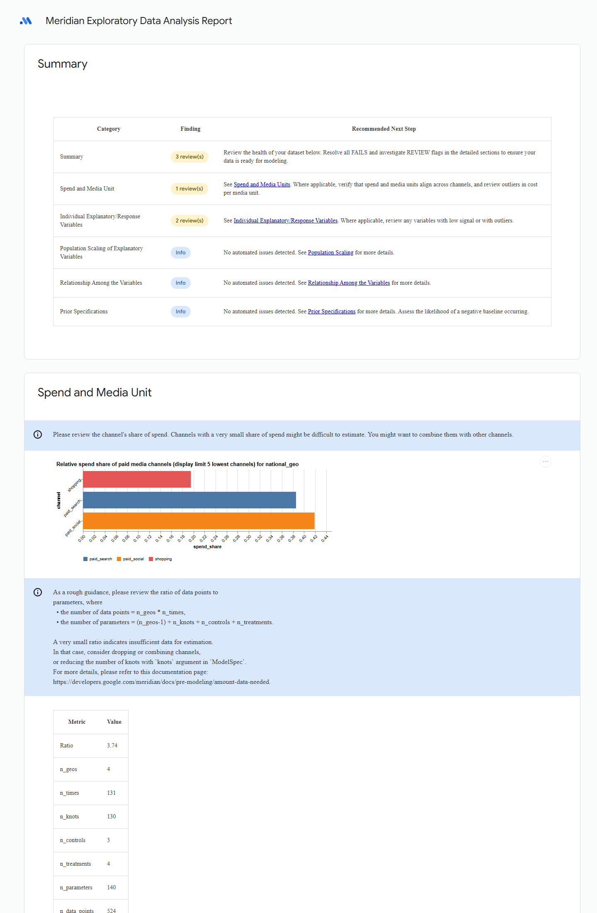

# Official Meridian EDA — golden HTML review

Human-review evidence only. Analytical truth remains the structured EDA receipt.

| Field | Value |
|---|---|
| run_id | `m3cloudd71022178a54` |
| source | Official `MeridianEDA.generate_and_save_report` |
| local preview | [m3cloudd71022178a54-meridian_eda_report_preview.png](m3cloudd71022178a54-meridian_eda_report_preview.png) |
| canonical HTML | `gs://modelready-m3-912257136465-artifacts/music-center/mmm-demo/runs/m3cloudd71022178a54/eda/meridian_eda_report.html` |
| HTML SHA256 | `371287f4ba0906fa3a9e5956c9bbf180497e7dfa66bbf01f292bb24cc01266fb` |

The screenshot is the first screen of the untouched official report: summary chips, spend-share chart, and official data-adequacy scalars (`n_geos=4`, `n_times=131`, `n_knots=130`, `n_data_points=524`). It is not a substitute for the structured receipt.

