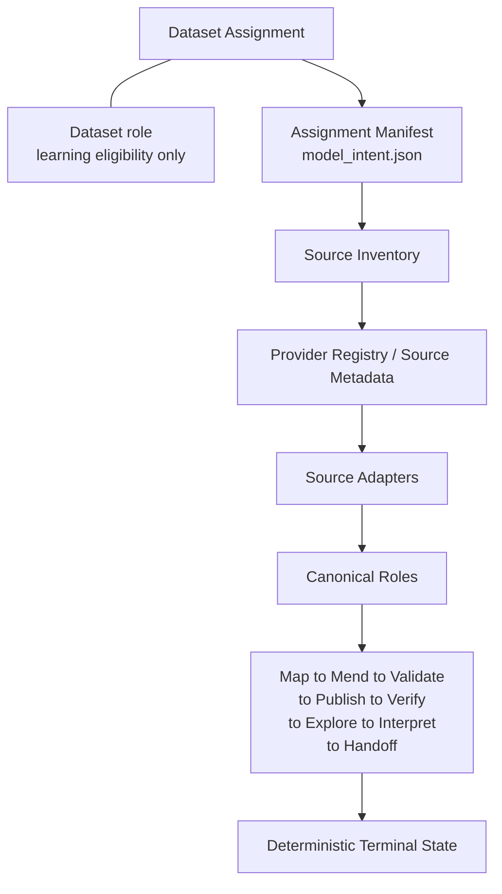

# Provider-Agnostic Coordinator

**Date:** 2026-08-17  
**Status:** local coordinator qualification complete; multi-dataset cloud qualification not started on a new revision  
**Domain view for this work:** 1.0.0  
**Does not claim:** EXPERIENCE_LEARNED, EXPERIENCE_APPLIED, DOMAIN_VIEW v2

## Original limitation

Dataset A (Music Center) proved the full pre-modeling path on Cloud Run revision `modelready-m3-00012-8xq`, run `m3cloudc5b11fe79553`, terminal `MODEL_READY`.

Dataset B (Stride & Field) then fail-closed on that same revision because initialization required Music Center filenames:

- `google_ads_daily.csv`
- `meta_ads_weekly.csv`
- `controls_weekly.csv`

That was correct fail-closed behavior. It also proved the coordinator was still an assignment-shaped Music Center pipeline, not a product that can inventory an arbitrary assignment.

## Why it existed

The golden slice optimized for one proven package. Runtime package checks, issue detection, repairs, and frame assembly all assumed Dataset A's source filenames.

## New architecture

Runtime identity comes from the assignment's `model_intent.json` plus typed source descriptors. Filename is transport metadata.



Dataset role sits beside the assignment. It governs MEL learning eligibility. It does not select source-parsing algorithms.

Music Center, Stride & Field, and Summit & Pine all enter this coordinator. They may finish in different terminal states.

## Source-discovery path

1. Reject `truth/` and regression-truth filenames.
2. Require `model_intent.json`.
3. Inventory package files.
4. Identify provider/report from registry hints, declared intent fields, and column evidence.
5. Classify canonical roles: paid media, KPI, revenue, organic, controls, population, inactivity evidence.
6. Required providers come from the intent contract. Missing required providers fail closed as `MISSING_REQUIRED_SOURCE`.
7. Optional inactivity evidence may be absent.
8. Expected-answer files are never runtime inputs.

Persisted receipt: `source_inventory_receipt.json`.

## Adapter boundary

`app/tools/source_adapters.py` performs deterministic mechanics:

- date parsing and week-ending to Monday-start conversion
- currency and `cost_micros` conversion
- geo aliases onto the assignment population set
- channel aliases onto declared model-intent channels
- exact-duplicate removal
- campaign/product-group aggregation of **summable** metrics only
- daily to weekly aggregation
- documented-inactivity zero-fill when evidence says it is safe

Adapters do not assign causal roles, final priors, knots, ModelSpec, or posterior behavior. Unknown absence is not converted to zero.

## Safety boundaries

- Unknown media absence remains distinct from confirmed inactivity.
- KPI/control imputation is not AUTO_SAFE.
- Non-summable rates (`ctr`, `open_rate`, `click_rate`, `roas`, ...) are not additive exposure.
- `attributed_sales` is not treated as media exposure.
- Dataset C remains `SEALED_HOLDOUT` and is processed only as `HOLDOUT_QUALIFICATION_ONLY`.
- Expected contracts stay on the test/evaluation side.

## A / B / C local qualification

| Assignment | Initialize | Inventory | Map/Mend | Terminal |
|---|---|---|---|---|
| Dataset A Music Center | PASS | PASS | PASS | VALIDATING, 5 AUTO_SAFE, 524×16, readiness PASS |
| Dataset B Stride & Field | PASS | Microsoft/TikTok/Amazon/GA4/Shopify/Klaviyo | PASS without Music Center filenames | WAITING_FOR_APPROVAL |
| Dataset C Summit & Pine | PASS | PMS/Stripe/Google/Pinterest/Meta split | PASS without Music Center filename gates | HOLDOUT_QUALIFICATION_ONLY; seal unchanged |

Dataset C package fingerprint:

`f1bfaa5ba98b8f6d94cccb6b7a19c1e50ab8e315567e82fa3cf22129193bf18f`

## Generic runner

```text
python scripts/run_cloud_dataset.py --dataset-id dataset_a_music_center --local
python scripts/run_cloud_dataset.py --dataset-id dataset_b_stride_and_field --local
python scripts/run_cloud_dataset.py --dataset-id dataset_c_summit_and_pine --local
```

`scripts/run_cloud_dataset.py` invokes the same coordinator locally (`--local`) or on Cloud Run (default). Dataset A golden scorecard remains `scripts/run_cloud_dataset_a.py`.

Local Dataset A regression after generalization:

- issues 5 / AUTO_SAFE 5 / forbidden 0
- 524 × 16
- model-frame fingerprint `7cfc15152067923b6ec6d2b77d6b4e4fae16b748eae24deb250939e7458fe18f`
- unit tests: 320 passed, 1 skipped

## Golden cloud checkpoint preserved

Do not treat this refactor as the engine behind the old golden run.

- Service: `modelready-m3`
- Revision: `modelready-m3-00012-8xq`
- Image: `sha256:8a099d90e0a5bd99ee5ee663e906dde4190b82650a95a267ef3c206d843e5f69`
- Dataset A run: `m3cloudc5b11fe79553`
- Terminal: `MODEL_READY`

A future generalized Cloud Run revision is a new qualification revision.

## Frontend

The frontend directory was not modified.
